# System Architecture Analysis

## Overview

- **Project**: /home/tom/github/wronai/clickmd
- **Analysis Mode**: static
- **Total Functions**: 220
- **Total Classes**: 11
- **Modules**: 26
- **Entry Points**: 193

## Architecture by Module

### renderer
- **Functions**: 43
- **Classes**: 1
- **File**: `renderer.py`

### progress
- **Functions**: 30
- **Classes**: 4
- **File**: `progress.py`

### logger
- **Functions**: 30
- **Classes**: 1
- **File**: `logger.py`

### devtools
- **Functions**: 15
- **Classes**: 2
- **File**: `devtools.py`

### themes
- **Functions**: 14
- **Classes**: 1
- **File**: `themes.py`

### rich_backend
- **Functions**: 13
- **Classes**: 1
- **File**: `rich_backend.py`

### help
- **Functions**: 9
- **File**: `help.py`

### examples.logger_usage
- **Functions**: 8
- **File**: `logger_usage.py`

### examples.phase1_features
- **Functions**: 7
- **File**: `phase1_features.py`

### examples.phase4_themes
- **Functions**: 7
- **File**: `phase4_themes.py`

### examples.phase5_devtools
- **Functions**: 7
- **Classes**: 1
- **File**: `phase5_devtools.py`

### examples.config_viewer
- **Functions**: 6
- **File**: `config_viewer.py`

### examples.phase3_progress
- **Functions**: 6
- **File**: `phase3_progress.py`

### examples.simple_cli
- **Functions**: 5
- **File**: `simple_cli.py`

### tools.md_to_html
- **Functions**: 5
- **File**: `md_to_html.py`

### clickmd
- **Functions**: 4
- **File**: `__init__.py`

### examples.cli_app
- **Functions**: 4
- **File**: `cli_app.py`

### examples.markdown_help
- **Functions**: 4
- **File**: `markdown_help.py`

### examples.api_response
- **Functions**: 1
- **File**: `api_response.py`

### examples.colored_logging
- **Functions**: 1
- **File**: `colored_logging.py`

## Key Entry Points

Main execution flows into the system:

### renderer.MarkdownRenderer.table
> Render a table with configurable style.

Args:
    headers: Column headers
    rows: Table rows (list of lists)
    style: Border style - "ascii", "un
- **Calls**: enumerate, self._get_table_chars, len, enumerate, len, self._writeln, self._writeln, enumerate

### devtools.inspect_obj
> Inspect an object showing its type, methods, and attributes.

Args:
    obj: Object to inspect
    markdown_safe: Wrap in codeblock for markdown compa
- **Calls**: renderer.get_renderer, rich_backend._FallbackConsole.print, rich_backend._FallbackConsole.print, rich_backend._FallbackConsole.print, rich_backend._FallbackConsole.print, isinstance, rich_backend._FallbackConsole.print, renderer._c

### examples.custom_renderer.main
- **Calls**: rich_backend._FallbackConsole.print, MarkdownRenderer, renderer.heading, renderer.codeblock, rich_backend._FallbackConsole.print, MarkdownRenderer, no_color.heading, no_color.codeblock

### renderer.MarkdownRenderer._highlight_python
- **Calls**: None.startswith, re.sub, re.sub, re.sub, re.sub, re.sub, re.sub, re.sub

### devtools.PrettyExceptionFormatter.format_exception
> Format an exception with full traceback.
- **Calls**: lines.append, lines.append, lines.append, lines.append, lines.append, lines.append, lines.append, lines.append

### renderer.MarkdownRenderer._highlight_log
- **Calls**: line.strip, trimmed.startswith, trimmed.startswith, trimmed.startswith, trimmed.startswith, trimmed.startswith, self._c, self._c

### examples.logger_usage.real_world_example
> Real-world evolution pipeline example
- **Calls**: clickmd.md, Logger, log.heading, log.heading, log.llm, log.attempt, log.success, log.heading

### devtools.diff
> Display a colored diff between two texts.

Args:
    old: Original text (string or list of lines)
    new: New text (string or list of lines)
    old_
- **Calls**: renderer.get_renderer, difflib.unified_diff, isinstance, old.splitlines, list, isinstance, new.splitlines, list

### renderer.MarkdownRenderer.panel
> Render content in a styled panel/box.

Args:
    content: Text content (can be multiline)
    title: Optional panel title
    style: Panel style - "de
- **Calls**: style_colors.get, self._get_terminal_width, self._writeln, content.split, self._writeln, min, self._writeln, len

### renderer.MarkdownRenderer._highlight_yaml
- **Calls**: None.startswith, re.match, None.startswith, self._c, m.groups, self._c, self._c, value.strip

### renderer.MarkdownRenderer._highlight_line
- **Calls**: None.lower, self._c, self._highlight_yaml, self._highlight_json, self._highlight_bash, self._highlight_js, self._highlight_python, self._highlight_markdown

### progress.ProgressBar._render
> Render the progress bar.
- **Calls**: int, self._renderer._c, parts.append, progress._write_inline, progress._is_tty, parts.append, parts.append, parts.append

### examples.phase3_progress.demo_combined
> Demonstrate combined usage.
- **Calls**: clickmd.md, clickmd.StatusIndicator, status.start, time.sleep, status.done, clickmd.md, clickmd.progress, status.start

### renderer.MarkdownRenderer._highlight_css
> Highlight CSS syntax.
- **Calls**: re.sub, re.sub, re.sub, None.startswith, None.startswith, self._c, line.strip, line.strip

### renderer.MarkdownRenderer._highlight_js
- **Calls**: None.startswith, re.sub, re.sub, re.sub, self._c, re.sub, result.split, line.strip

### help._format_option_help
> Format option/argument help text with inline markdown.
Handles **bold**, *italic*, `code` inline.
- **Calls**: MarkdownRenderer, re.sub, re.sub, re.sub, re.sub, re.sub, re.sub, re.sub

### examples.phase3_progress.demo_status_indicator
> Demonstrate status indicator.
- **Calls**: clickmd.md, clickmd.StatusIndicator, status.start, time.sleep, status.done, status.start, time.sleep, status.done

### renderer.MarkdownRenderer._highlight_php
> Highlight PHP syntax.
- **Calls**: re.sub, re.sub, re.sub, None.startswith, None.startswith, self._c, re.sub, self._c

### examples.phase5_devtools.demo_debug
> Demonstrate debug output.
- **Calls**: clickmd.md, clickmd.md, clickmd.debug, clickmd.debug, clickmd.debug, clickmd.debug, clickmd.debug, clickmd.md

### renderer.MarkdownRenderer._highlight_html
> Highlight HTML/XML syntax.
- **Calls**: None.startswith, re.sub, re.sub, re.sub, self._c, line.strip, m.group, self._c

### examples.phase3_progress.demo_spinners
> Demonstrate spinners.
- **Calls**: clickmd.md, clickmd.md, clickmd.md, clickmd.md, clickmd.md, clickmd.table, clickmd.spinner, time.sleep

### examples.phase1_features.demo_nested_lists
> Demonstrate nested list rendering.
- **Calls**: clickmd.md, clickmd.md, clickmd.get_renderer, renderer.list_item, renderer.list_item, renderer.list_item, renderer.list_item, renderer.list_item

### progress.countdown
> Display a countdown timer.

Args:
    seconds: Number of seconds to count down
    message: Message to display
    on_complete: Callback when countdow
- **Calls**: renderer.get_renderer, range, progress._clear_line, rich_backend._FallbackConsole.print, progress._is_tty, time.sleep, renderer._c, on_complete

### renderer.MarkdownRenderer.render_markdown_with_fences
- **Calls**: None.split, logger.Logger.flush, self.codeblock, line.rstrip, re.match, None.join, m.group, self._writeln

### renderer.MarkdownRenderer._highlight_json
- **Calls**: re.sub, re.sub, re.sub, re.sub, re.sub, self._c, self._c, self._c

### renderer.MarkdownRenderer._highlight_ruby
> Highlight Ruby syntax.
- **Calls**: None.startswith, re.sub, re.sub, re.sub, self._c, re.sub, line.strip, self._c

### renderer.MarkdownRenderer._highlight_c
> Highlight C/C++ syntax.
- **Calls**: re.sub, re.sub, None.startswith, None.startswith, self._c, re.sub, self._c, self._c

### examples.phase3_progress.demo_progress_bar
> Demonstrate progress bar.
- **Calls**: clickmd.md, clickmd.md, range, clickmd.progress, clickmd.md, clickmd.md, clickmd.progress, time.sleep

### examples.phase1_features.demo_panels
> Demonstrate panel/box rendering.
- **Calls**: clickmd.md, clickmd.md, clickmd.panel, clickmd.md, clickmd.panel, clickmd.md, clickmd.panel, clickmd.md

### devtools.PrettyExceptionFormatter._format_frame
> Format a single traceback frame.
- **Calls**: self._shorten_path, self._renderer._c, lines.append, lines.append, self._renderer._c, self._highlight_python, self._renderer._c, self._renderer._c

## Process Flows

Key execution flows identified:

### Flow 1: table
```
table [renderer.MarkdownRenderer]
```

### Flow 2: inspect_obj
```
inspect_obj [devtools]
  └─ →> get_renderer
  └─ →> print
  └─ →> print
```

### Flow 3: main
```
main [examples.custom_renderer]
  └─ →> print
  └─ →> print
```

### Flow 4: _highlight_python
```
_highlight_python [renderer.MarkdownRenderer]
```

### Flow 5: format_exception
```
format_exception [devtools.PrettyExceptionFormatter]
```

### Flow 6: _highlight_log
```
_highlight_log [renderer.MarkdownRenderer]
```

### Flow 7: real_world_example
```
real_world_example [examples.logger_usage]
  └─ →> md
      └─ →> render_markdown
          └─> get_renderer
```

### Flow 8: diff
```
diff [devtools]
  └─ →> get_renderer
```

### Flow 9: panel
```
panel [renderer.MarkdownRenderer]
```

### Flow 10: _highlight_yaml
```
_highlight_yaml [renderer.MarkdownRenderer]
```

## Key Classes

### renderer.MarkdownRenderer
- **Methods**: 35
- **Key Methods**: renderer.MarkdownRenderer.__init__, renderer.MarkdownRenderer._c, renderer.MarkdownRenderer._get_terminal_width, renderer.MarkdownRenderer._writeln, renderer.MarkdownRenderer.heading, renderer.MarkdownRenderer.codeblock, renderer.MarkdownRenderer.render_markdown_with_fences, renderer.MarkdownRenderer._highlight_line, renderer.MarkdownRenderer._highlight_log, renderer.MarkdownRenderer._highlight_markdown

### logger.Logger
> Markdown-aware logger that wraps output in codeblocks.

All log methods automatically wrap output in
- **Methods**: 23
- **Key Methods**: logger.Logger.__init__, logger.Logger._emit, logger.Logger._render_log_block, logger.Logger.flush, logger.Logger.debug, logger.Logger.info, logger.Logger.warning, logger.Logger.error, logger.Logger.success, logger.Logger.action

### progress.ProgressBar
> A customizable progress bar.

Example:
    bar = ProgressBar(total=100, label="Downloading")
    for
- **Methods**: 7
- **Key Methods**: progress.ProgressBar.__init__, progress.ProgressBar.update, progress.ProgressBar.set, progress.ProgressBar._render, progress.ProgressBar.finish, progress.ProgressBar.__enter__, progress.ProgressBar.__exit__

### progress.Spinner
> An animated spinner for indeterminate progress.

Example:
    with Spinner("Loading..."):
        do
- **Methods**: 6
- **Key Methods**: progress.Spinner.__init__, progress.Spinner.start, progress.Spinner._animate, progress.Spinner.stop, progress.Spinner.__enter__, progress.Spinner.__exit__

### progress.LiveUpdate
> Live-updating display that refreshes in place.

Example:
    with LiveUpdate() as live:
        for 
- **Methods**: 5
- **Key Methods**: progress.LiveUpdate.__init__, progress.LiveUpdate.update, progress.LiveUpdate.clear, progress.LiveUpdate.__enter__, progress.LiveUpdate.__exit__

### progress.StatusIndicator
> A status indicator that shows step-by-step progress.

Example:
    status = StatusIndicator()
    st
- **Methods**: 5
- **Key Methods**: progress.StatusIndicator.__init__, progress.StatusIndicator.start, progress.StatusIndicator.done, progress.StatusIndicator.fail, progress.StatusIndicator.skip

### devtools.PrettyExceptionFormatter
> Format exceptions with syntax highlighting and context.

Features:
- Syntax-highlighted code snippet
- **Methods**: 5
- **Key Methods**: devtools.PrettyExceptionFormatter.__init__, devtools.PrettyExceptionFormatter.format_exception, devtools.PrettyExceptionFormatter._format_frame, devtools.PrettyExceptionFormatter._shorten_path, devtools.PrettyExceptionFormatter._highlight_python

### rich_backend._FallbackConsole
> Simple console wrapper when Rich is not available.
- **Methods**: 3
- **Key Methods**: rich_backend._FallbackConsole.__init__, rich_backend._FallbackConsole.print, rich_backend._FallbackConsole.rule

### devtools.ClickmdHandler
> Logging handler that formats logs with clickmd styling.

Usage:
    import logging
    from clickmd 
- **Methods**: 3
- **Key Methods**: devtools.ClickmdHandler.__init__, devtools.ClickmdHandler.emit, devtools.ClickmdHandler.format_record
- **Inherits**: logging.Handler

### themes.Theme
> Color theme definition.
- **Methods**: 1
- **Key Methods**: themes.Theme.get_color

### examples.phase5_devtools.User
> Sample user class for debugging.
- **Methods**: 0

## Data Transformation Functions

Key functions that process and transform data:

### help._format_option_help
> Format option/argument help text with inline markdown.
Handles **bold**, *italic*, `code` inline.
- **Output to**: MarkdownRenderer, re.sub, re.sub, re.sub, re.sub

### examples.markdown_help.process
> # Process Data

Transform and process input files with **configurable** options.

## Supported Forma
- **Output to**: cli.command, clickmd.option, clickmd.option, clickmd.option, clickmd.option

### tools.md_to_html.convert_directory
- **Output to**: sorted, md_dir.glob, md_path.with_suffix, md_path.read_text, tools.md_to_html.markdown_to_html

### devtools.PrettyExceptionFormatter.format_exception
> Format an exception with full traceback.
- **Output to**: lines.append, lines.append, lines.append, lines.append, lines.append

### devtools.PrettyExceptionFormatter._format_frame
> Format a single traceback frame.
- **Output to**: self._shorten_path, self._renderer._c, lines.append, lines.append, self._renderer._c

### devtools._format_debug_value
> Format a value for debug output.
- **Output to**: isinstance, isinstance, isinstance, isinstance, isinstance

### devtools.ClickmdHandler.format_record
> Format a log record with styling.
- **Output to**: self.LEVEL_STYLES.get, record.getMessage, parts.append, None.join, None.strftime

## Behavioral Patterns

### recursion_print
- **Type**: recursion
- **Confidence**: 0.90
- **Functions**: rich_backend._FallbackConsole.print

### recursion__format_debug_value
- **Type**: recursion
- **Confidence**: 0.90
- **Functions**: devtools._format_debug_value

### recursion_tree
- **Type**: recursion
- **Confidence**: 0.90
- **Functions**: devtools.tree

### state_machine_ProgressBar
- **Type**: state_machine
- **Confidence**: 0.70
- **Functions**: progress.ProgressBar.__init__, progress.ProgressBar.update, progress.ProgressBar.set, progress.ProgressBar._render, progress.ProgressBar.finish

### state_machine_Spinner
- **Type**: state_machine
- **Confidence**: 0.70
- **Functions**: progress.Spinner.__init__, progress.Spinner.start, progress.Spinner._animate, progress.Spinner.stop, progress.Spinner.__enter__

### state_machine_LiveUpdate
- **Type**: state_machine
- **Confidence**: 0.70
- **Functions**: progress.LiveUpdate.__init__, progress.LiveUpdate.update, progress.LiveUpdate.clear, progress.LiveUpdate.__enter__, progress.LiveUpdate.__exit__

## Public API Surface

Functions exposed as public API (no underscore prefix):

- `tools.md_to_html.markdown_to_html` - 94 calls
- `renderer.MarkdownRenderer.table` - 44 calls
- `devtools.inspect_obj` - 39 calls
- `examples.custom_renderer.main` - 37 calls
- `clickmd.menu` - 26 calls
- `rich_backend.render_table` - 26 calls
- `devtools.PrettyExceptionFormatter.format_exception` - 26 calls
- `examples.logger_usage.real_world_example` - 25 calls
- `devtools.diff` - 25 calls
- `renderer.MarkdownRenderer.panel` - 24 calls
- `devtools.tree` - 24 calls
- `examples.phase3_progress.demo_combined` - 19 calls
- `examples.phase3_progress.demo_status_indicator` - 17 calls
- `examples.phase5_devtools.demo_debug` - 16 calls
- `rich_backend.render_panel` - 15 calls
- `examples.phase3_progress.demo_spinners` - 15 calls
- `examples.phase1_features.demo_nested_lists` - 15 calls
- `progress.countdown` - 14 calls
- `renderer.MarkdownRenderer.render_markdown_with_fences` - 14 calls
- `examples.phase3_progress.demo_progress_bar` - 13 calls
- `examples.phase1_features.demo_panels` - 13 calls
- `examples.markdown_help.process` - 12 calls
- `examples.phase3_progress.demo_live_update` - 12 calls
- `devtools.ClickmdHandler.format_record` - 12 calls
- `renderer.MarkdownRenderer.codeblock` - 11 calls
- `examples.logger_usage.progress_and_steps` - 11 calls
- `examples.logger_usage.grouped_output` - 11 calls
- `examples.markdown_help.config` - 11 calls
- `examples.phase5_devtools.demo_logging` - 11 calls
- `examples.simple_cli.status` - 10 calls
- `themes.color` - 9 calls
- `examples.phase1_features.demo_tables` - 9 calls
- `examples.phase1_features.demo_horizontal_rules` - 9 calls
- `clickmd.echo` - 8 calls
- `progress.Spinner.stop` - 8 calls
- `examples.logger_usage.action_logging` - 8 calls
- `examples.logger_usage.llm_logging` - 8 calls
- `examples.logger_usage.mixed_output` - 8 calls
- `examples.config_viewer.show_env_config` - 8 calls
- `examples.phase4_themes.demo_custom_theme` - 8 calls

## System Interactions

How components interact:

```mermaid
graph TD
    table --> enumerate
    table --> _get_table_chars
    table --> len
    inspect_obj --> get_renderer
    inspect_obj --> print
    main --> print
    main --> MarkdownRenderer
    main --> heading
    main --> codeblock
    _highlight_python --> startswith
    _highlight_python --> sub
    format_exception --> append
    _highlight_log --> strip
    _highlight_log --> startswith
    real_world_example --> md
    real_world_example --> Logger
    real_world_example --> heading
    real_world_example --> llm
    diff --> get_renderer
    diff --> unified_diff
    diff --> isinstance
    diff --> splitlines
    diff --> list
    panel --> get
    panel --> _get_terminal_width
    panel --> _writeln
    panel --> split
    _highlight_yaml --> startswith
    _highlight_yaml --> match
    _highlight_yaml --> _c
```



## Reverse Engineering Guidelines

1. **Entry Points**: Start analysis from the entry points listed above
2. **Core Logic**: Focus on classes with many methods
3. **Data Flow**: Follow data transformation functions
4. **Process Flows**: Use the flow diagrams for execution paths
5. **API Surface**: Public API functions reveal the interface

## Context for LLM

Maintain the identified architectural patterns and public API surface when suggesting changes.